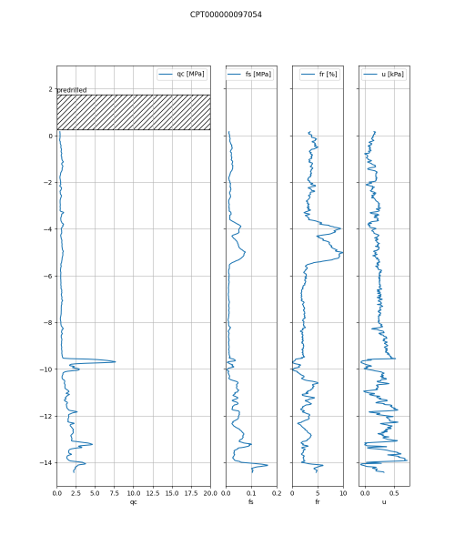
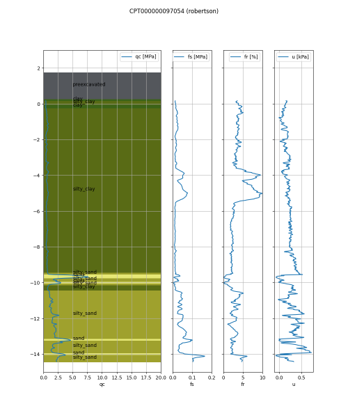
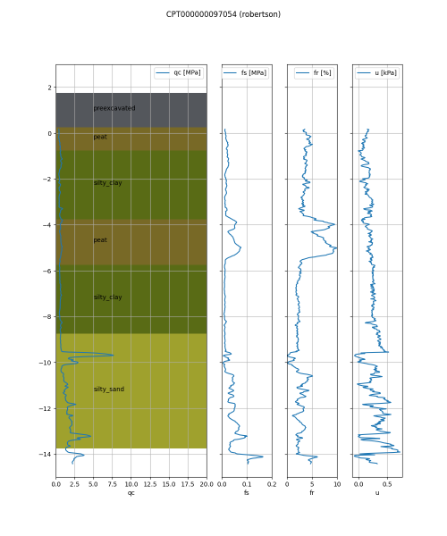
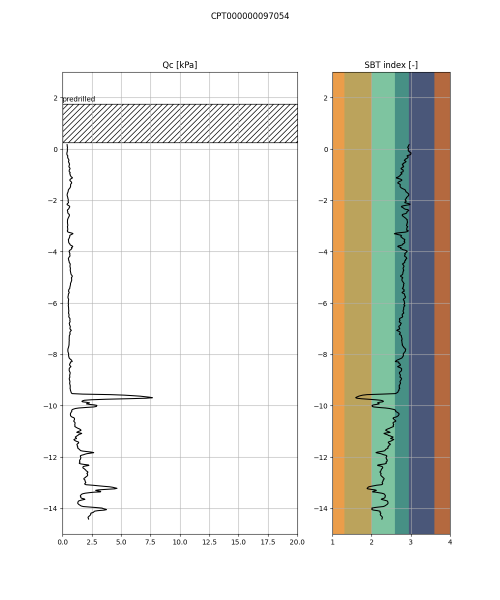
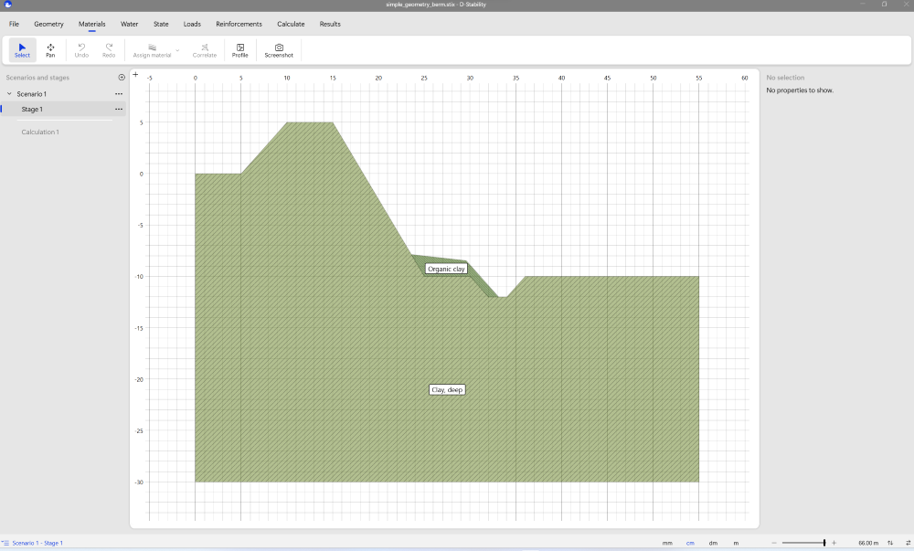
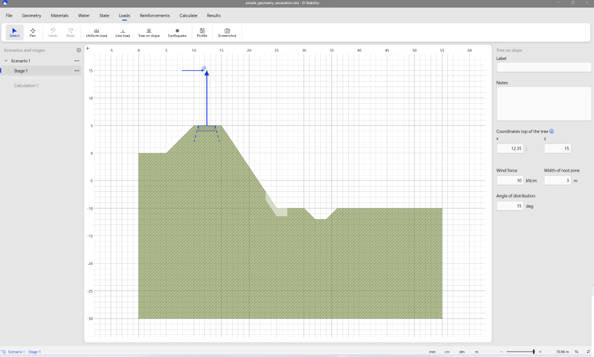
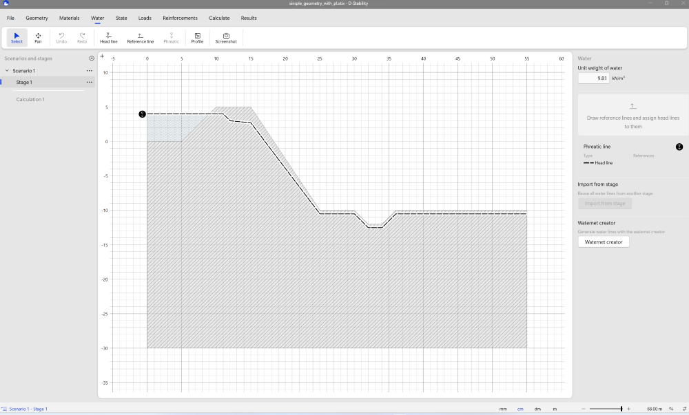

## LeveeLogic

[](https://github.com/breinbaas/leveelogic/actions/workflows/python-package.yml)

Code for levee assessments by Rob van Putten | LeveeLogic

This code will slowly replace our old code and make it publicly available under the GPLv3 license. This code is based on years of experience in levee assessments and automation and makes use of some spezialized packages like d-geolib and other code that has been created by the community of Dutch geotechnical engineers. One thing; **don't blame me or my code if your structure fails.. never trust a computer (too much) without a decent amount of experience** ;-)

**TIP** You can learn a lot of how to use the leveelogic package by looking at the test code which you can find under the tests/ path

## Functionality

### Soon to be added 

For users;
 
* [X] Cpts
* [ ] Boreholes
* [X] DStability interaction / serialization / parsing / editing
* [ ] Crosssections
* [ ] Geotechnical profiles

For developers;

* [X] Automated packaging for pip install
* [X] Automated testing CI/CD

and more... 

**NOTE** This code will be written in my sparetime so don't go pushing me unless you are willing to pay. I am making an effort to create something that is easy to use and has decent documentation and this takes time.

### CPT

#### Reading

You can read CPT files that are formated in the GEF or XML format. Loading the cpts is easy;

```python:
cpt = Cpt.from_file("mycpt.gef")
cpt = Cpt.from_file("mycpt.xml")
```

If you like to work with online data you will be happy to know that this package also provides a ```from_string``` option. Just don't forget to add the right suffix;

```python:
cpt = Cpt.from_string(s, suffix=".gef")
cpt = Cpt.from_string(s, suffix=".xml")
```

and finally, if you work in The Netherlands and would like to get CPT's from the BRO API you can simply type;

```python
cpt = Cpt.from_bro_id("CPT000000097074")
```

You just need to find the CPT id online and yes, we will be adding the option to download CPTs based on a geographical location later.

**NOTE** Go easy on the BRO API.. you never know when they will add an API key if things get out of hand so only download a reasonable amount of data

#### Interpretation

We have implemented three interpretation options;

* three type rule (sand, clay or peat) 
* CUR166 based on electrical cone and friction ratio
* My implementation of Robertson (not using the waterpressure)

Calling these will give you a SoilProfile1 object (1D soil structure) like so;

```python
cpt.to_soilprofile1()
```

You will have to set the interpretation method (CptConversionMethod) using on of these options;

* CptConversionMethod.THREE_TYPE_RULE being the three type rule
* CptConversionMethod.NL_RF being the CUR166 based on electrical cone and friction ratio
* CptConversionMethod.ROBERTSON being my implementation of the Robertson correlation

You can also state the minimum layerheight, the peat friction ratio and if you want the predrilled layer to be added to the result. Here is an example;

```python
cpt.to_soilprofile1(
    cptconversionmethod = CptConversionMethod.ROBERTSON,
    minimum_layerheight = 0.4,
    peat_friction_ratio = 5.0,
)
```

This will generate a SoilProfile1 object using the Robertson correlation, creating layers that are at least 0.4m thick and all measurements where the friction ration is equal to or above 5.0 will be converted to peat.

You can use the soillayers property of the SoilProfile1 object to see which soillayers were created.

#### Plotting

You can plot the CPT in multiple ways;

Really barebones;

```python
cpt.plot(filename=f"bro_cpt_download.png")
```

which will lead to a plot like this;



or you can use one of the three CptConversion methods. An example of using the Robertson interpretation would be;

```python
cpt.plot(
    "cpt_robertson_classification.png",
    cptconversionmethod=CptConversionMethod.ROBERTSON,
)
```



It is possible to define the minimum layer height so you get a managable amount of soillayers;

```python
cpt.plot(
    "cpt_robertson_classification_1m.png",
    cptconversionmethod=CptConversionMethod.ROBERTSON,
    minimum_layerheight=1.0,
)
```

It is also possible to override the Robertson interpretation with a simple rule that defines soil as peat if it is above a threshold for the friction ratio, this looks like the following code;

```python
cpt.plot(
    "cpt_robertson_classification_1m.png",
    cptconversionmethod=CptConversionMethod.ROBERTSON,
    minimum_layerheight=1.0,
    peat_friction_ratio=4.0,
)
```

This leads to the following plot;



In the previous case all measurements with a friction ratio of 4.0 or higher will be interpreted as being peat.

There is also an option to create an SBT index plot using the following code;

```python
cpt.plot_Ic("cpt_Ic_plot.png")
```




**DISCLAIMER**
The interpretation options of CPTs are endless and can be very specific for the region you are working in. For me these interpretation methods have proven their value but always check if they work for you!

## DStability

The DStability part of the library deals with the DGeo-Stability application for levee stability assessments. You can read and write stix files and use the algorithms to change properties in the calculations. I've chosen for a kind of modular approach where it is possible to chain algorithms. This enables people to write (and share!) their own algorithms. So it might seem a bit complicated but that's for a reason only time will tell is useful ;-)

Sometimes an algorithm needs a so called characteristic point. This idea was taken from the DAM (Dike Analysis Module) by Deltares. A levee has some specific points like a crest, ditches etc. LeveeLogic makes use of this system to enable users that will write their own algorithms to take advantage of. It is much easier to add a characteristic point to a model and use that in all the algorithms you use than defining that point again and again for each algorithm.

For developers; always inherit your own algorithm from the Algorithm class. Implement the _check function which should throw exceptions if the input is incorrect and always return a copy of the original model so people can keep their original ones. See the code for some examples.

### Meta data

It can be useful to extract metadata from the calculation so the following metadata properties have been added;

* remarks, will return the text in the remarks section (Project Info)
* num_scenarios, will return the number of scenarios in the file
* num_stages(scenario_index), will return the number of stages in the given scenario (note, 0 based!)
* stage_label(scenario_index, stage_index), will return the label of the stage
* scenario_label(scenario_index), will return the label of the scenario


### Soil parameters

A function has been added to extract all the soil names, codes and parameters from a loaded stix. Here's some example code;

```python
ds = DStability.from_stix("complex_geometry.stix")
lines = ds.extract_soilparameters()
```

This will return a list of strings which can exported to a csv file.

### Algorithms

So far the following algorithms have been added;

#### Algorithm berm

Add a berm to your DStability model. Here's an example;

```python
ds = DStability.from_stix("tests/testdata/stix/simple_geometry.stix")
ds.set_characteristic_point(25, point_type=CharacteristicPointType.TOE_RIGHT)
alg = AlgorithmBerm(
    ds=ds,
    soilcode="H_Rk_ko", # this code needs to be in the calculation model!
    slope_top=10, # slope on top of the berm
    slope_bottom=1, # slope on the right side of the berm (slope to the bottom) 
    initial_height=2.0, # the initial height from the given TOE_RIGHT characteristic point
    initial_width=6.0, # initial width
)
ds = alg.execute() # note that you get a copy of your model (but here I overwrite the original one)
ds.serialize("tests/testdata/output/simple_geometry_berm.stix") # write to file
```

**Note** In time the algorithm will handle more complex situations as well as automated berm growth

You will now have a berm added to your original calculation



#### Algorithm excavation

Add an excavation to the geometry. This will follow the surface. Here's some example code where we want to have an excavation at x coordinate 25m with a width of 4 meters and a depth of 1.5 meters;

```python
ds = DStability.from_stix("simple_geometry.stix")
alg = AlgorithmExcavation(ds=ds, x=25.0, width=4.0, depth=1.5)
ds = alg.execute()
ds.serialize("simple_geometry_excavation.stix")
```



**Note** the image also shows the result of adding a treeload using the AlgorithmTree.

#### Algorithm move

The move algorithm will simple move all points in the given x direction. So far I have not see a use case where the y location of all points needed to be changed but it is easy to implement if someone wants it really bad. The reason for creating this code is that it is handy to set the reference point of the levee at x=0.0 and if that was not the case this algorithm can be used to make that happen. Here's some sample code;

```python
ds = DStability.from_stix("simple_geometry.stix")
alg = AlgorithmMove(ds=ds, dx=10.0)
ds = alg.execute()
```

Now all points have moved 10 meters in the x direction.

#### Algorithm phreatic line

The algorithm for the phreatic line generates a phreatic line based on the given input parameters. 

**Note** Currently it is not possible to remove headlines so if your model already had a phreatic line you will get two headlines. Fortunaltely the old phreatic line will not have any effect on the calculation but it might look funny. I will look into a way to remove the old headline later.

Here is an example;

```python
ds = DStability.from_stix("simple_geometry_no_pl.stix")
ds.set_characteristic_point(
    10, point_type=CharacteristicPointType.REFERENCE_POINT
)
alg = AlgorithmPhreaticLine(
    ds=ds,
    waterlevel=4.0,
    waterlevel_polder=-11.0,
    waterlevel_offset=0.5,
    offset_points=[(1.0, 0.0), (2.0, -1.0)],
)
ds = alg.execute()
```

Explanation; you need to set the reference point because the phreatic line will have the waterlevel until that point, then follow the offset points (if set, in this case it will move 1m right and 0 down and then again 1m right (total 2m) and 1m down). It will also make sure that there is always 0.5m difference between the surface line and the phreatic line. It is still possible that with the 'right' parameters you mess up the phreatic line so always make sure to check the output.

Here's an image of a possible result;



**Note** Yep, still working on the ditch, it's an easy fix but I wanted to have the preliminary version out
**Note** There is an request sent to Deltares (january 2024) to be able to call the waternet creator from code, so far it is not implemented. This would enable an easy adjustement of the phreatic level.

#### Algorithm tree

Add a tree (with load) at a given location. Here's some sample code;

```python
ds = DStability.from_stix("simple_geometry.stix")
alg = AlgorithmTree(
    ds=ds,
    x=20.0,
    tree_height=10.0,
    width_of_root_zone=6.0,
    load=10.0,
    wind_force=15.0,
    angle_of_distribution=30,
)
ds = alg.execute()
ds.serialize("simple_geometry_tree_load.stix")
```

You can see a result of this algorithm in the image from the Algorithm excavation.

#### Algorithm fc phreatic line wsbd

This algorithm is written for the waterboard Brabantse Delta to enable the creation of 
fragility curves based on a varying river level. 

TODO > uitbreiden beschrijving!

#### Algorithm berm wsbd

This algorithm is written for the waterboard Brabantse Delta to enable the creation of 
automated berms. 

TODO > uitbreiden beschrijving!

## Credits

Credits go to;

* Deltares for the d-geolib package
* Thomas van der Linden for the gefxmlreader (I really do not like xml parsing ;-)
